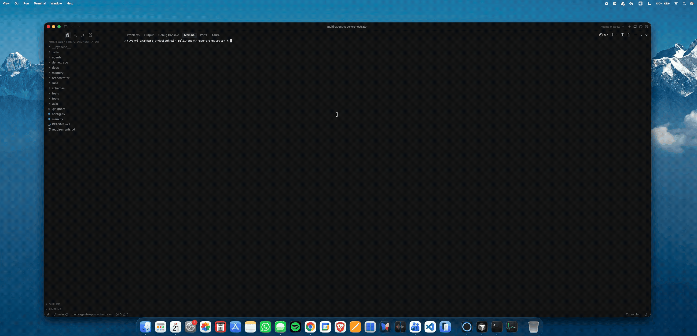
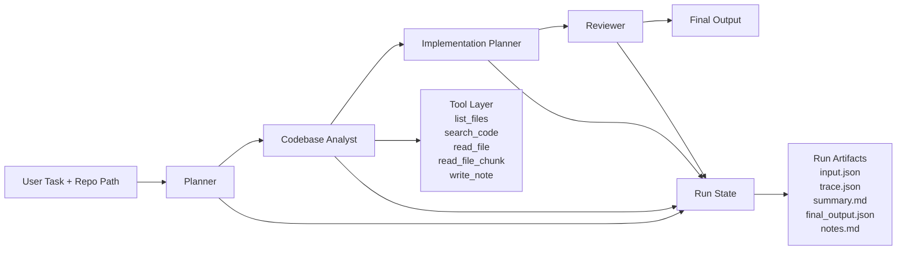

# RepoPilot

RepoPilot is a local multi-agent software engineering copilot built around a fixed role-specialized pipeline. It uses Ollama for local inference, inspects a target repository with a controlled tool layer, and produces grounded codebase explanations plus reviewer-checked implementation plans. The current project ships with a small demo backend in `demo_repo/` and a complete artifact trail for every run.



## Key Features

- Fixed four-stage pipeline: Planner -> Codebase Analyst -> Implementation Planner -> Reviewer
- Local inference with Ollama using `qwen2.5-coder:7b`
- Controlled repo analysis via local tools for file listing, code search, file reads, and note writing
- Grounded implementation planning with explicit risks and assumptions
- Reviewer stage for cross-checking coherence, scope, and missing evidence
- Verbose execution mode with concise stage progress
- Per-run artifacts including `input.json`, `trace.json`, `summary.md`, `final_output.json`, and `notes.md`
- Controlled demo repo aligned to three locked evaluation scenarios

## Architecture Overview

RepoPilot uses a deterministic one-shot pipeline rather than an open-ended agent graph:

1. `Planner` classifies the task and produces a structured workflow.
2. `Codebase Analyst` inspects the repository with the approved tool layer and gathers grounded evidence.
3. `Implementation Planner` turns that evidence into a minimal code-aware engineering plan.
4. `Reviewer` checks consistency, missing evidence, and scope discipline before the pipeline assembles the final response.

The agent pipeline is supported by:

- a small local tool layer for repository inspection
- shared Pydantic contracts for stage outputs and run state
- a file-based artifact/logging layer under `runs/`

See `docs/architecture.md` for a more technical walkthrough and `docs/architecture.svg` for a lightweight diagram artifact.

## Architecture Diagram



## Setup

### Requirements

- Python 3.11
- Ollama installed locally
- Ollama model: `qwen2.5-coder:7b`

### Installation

```bash
python3.11 -m venv .venv
source .venv/bin/activate
pip install -r requirements.txt
ollama pull qwen2.5-coder:7b
ollama serve
```

### Health Check

```bash
python main.py health
```

Expected shape:

- confirms the Ollama server is reachable
- confirms `qwen2.5-coder:7b` is installed
- runs a tiny generation test

## Usage

### Normal Run

```bash
python main.py run --repo demo_repo --task "Explain how user authentication works in this repo"
```

### Verbose Run

```bash
python main.py run --repo demo_repo --task "Find where rate limiting should be added for the login endpoint" --verbose
```

### Example Planning Run

```bash
python main.py run --repo demo_repo --task "Generate the minimal implementation plan for adding email verification"
```

Normal mode prints only the assembled final result. Verbose mode adds concise stage progress such as `starting planner`, `analyst retry triggered`, and `final assembly complete`.

## Demo Scenarios

The controlled demo backend in `demo_repo/` is intentionally designed around these locked prompts:

1. `Explain how user authentication works in this repo`
2. `Find where rate limiting should be added for the login endpoint`
3. `Generate the minimal implementation plan for adding email verification`

Why this demo repo exists:

- it provides a believable but compact backend-style structure
- it has a traceable login/auth flow
- it has a clear rate-limiting insertion point on login
- it includes an email service placeholder
- it deliberately does **not** implement email verification yet

See `docs/demo-notes.md` for the strongest demo runs and walkthrough notes.

## Example Outputs And Artifacts

Each run creates a folder under `runs/`:

```text
runs/
  2026-04-22T00-58-37-397509_find-where-rate-limiting-should-be-added-for-the/
    input.json
    trace.json
    summary.md
    final_output.json
    notes.md
```

Artifact purpose:

- `input.json`: effective run inputs
- `trace.json`: stage outputs, timings, attempts, retries, and run-state snapshot
- `summary.md`: human-readable run summary for demos
- `final_output.json`: final assembled result only
- `notes.md`: preserved notes written during analysis

Representative final output shape:

```text
Task summary: Find where rate limiting should be added for the login endpoint
Key files: src/api/auth_routes.py, src/api/routes.py, ...

Final response:
Task type: find_feature_location.
Grounded files: ...
Proposed changes: ...
Implementation steps: ...
Reviewer assessment: Strong and grounded.
```

## Design Decisions

- **Local inference with Ollama**: keeps the system self-contained and easy to demo offline.
- **Fixed pipeline**: a deterministic Planner -> Analyst -> Implementation Planner -> Reviewer flow is easier to inspect and debug than an arbitrary agent graph.
- **Controlled tool layer**: repo analysis goes through explicit file/search tools instead of free-form shell or code execution.
- **No code editing in v1**: the current system analyzes and plans; it does not write patches or modify the target repo.
- **Structured contracts everywhere**: shared Pydantic schemas make each stage inspectable and artifact-friendly.
- **File-based observability**: every run writes readable and machine-readable artifacts under `runs/`.
- **Controlled demo environment**: `demo_repo/` gives the project repeatable, known-good scenarios for evaluation and presentation.

## Limitations

- No automatic patch generation or code editing
- No arbitrary shell execution inside the agent pipeline
- No embeddings or RAG in v1
- Best suited today for small and medium repositories
- Local-model quality and speed depend on the installed Ollama model and hardware
- The demo repo is intentionally controlled; open-ended real-world repos will be noisier
- The current system is one-shot rather than interactive multi-turn collaboration

## Future Work

- Add code patch generation for grounded implementation plans
- Improve repository parsing and symbol extraction
- Add stronger context compression for larger repos
- Expand beyond the fixed pipeline into a richer interactive mode
- Improve evaluation coverage beyond the locked demo prompts

## Additional Docs

- `docs/architecture.md` — technical architecture notes
- `docs/architecture.svg` — lightweight architecture diagram artifact
- `docs/demo-notes.md` — locked demo prompts and strongest walkthrough candidates
